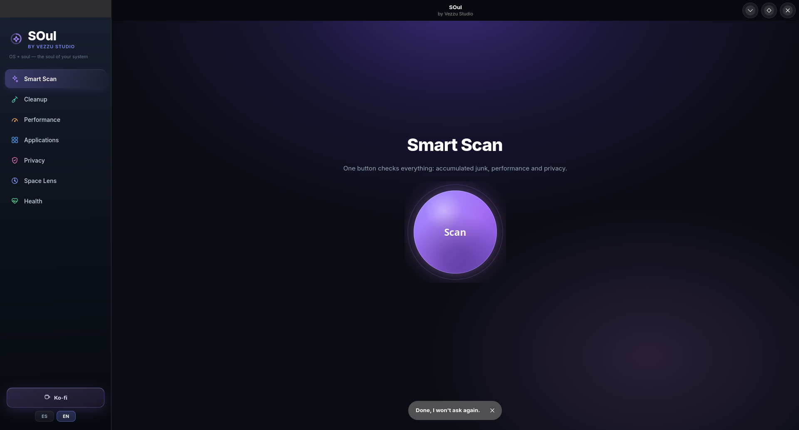

<div align="center">



<br>

**SO** (Sistema Operativo) + **alma** = **SOul.**<br>
Cuidado completo del sistema para Linux, bilingüe, con una interfaz que no
te obliga a saber qué es `VIRT`, `RES` o `NI`.

<br>


[**Descargar**](https://github.com/vezzulab/soul/releases/latest) &nbsp;·&nbsp; [**Sitio web**](https://vezzulab.github.io/soul/) &nbsp;·&nbsp; [Reportar un problema](https://github.com/vezzulab/soul/issues)

</div>

<br>

## Por qué SOul

Los monitores de procesos clásicos muestran columnas pensadas para
administradores de sistemas: `VIRT`, `RES`, `NI`... SOul lee los mismos
datos y te los dice en tu idioma, con un botón para arreglarlo.

## Qué hace

| Módulo | Qué resuelve |
|---|---|
| **Escaneo inteligente** | Un botón revisa basura, rendimiento y privacidad, y da un solo número |
| **Limpieza** | Caché, miniaturas, papelera, paquetes descargados, registros, volcados de fallos, cachés de Flatpak y de herramientas de desarrollo |
| **Rendimiento** | Apps que más consumen (con botón para cerrarlas), qué arranca solo al encender, servicios que fallaron |
| **Aplicaciones** | Lo instalado y las actualizaciones pendientes de Fedora y Flatpak |
| **Privacidad** | Caché del navegador, cookies, archivos recientes, historial de comandos |
| **Mapa de espacio** | Carpetas y archivos más grandes, de mayor a menor |
| **Salud del equipo** | Memoria, procesador, disco, batería, temperatura y **estado SMART del disco** |

## Cómo evita romper el sistema

Un limpiador da miedo con razón. Estas son las decisiones concretas:

1. **Doble filtro de procesos.** Una lista de demonios del sistema y del
   escritorio (`plasmashell`, `kwin_wayland`, `pipewire`,
   `systemd-journald`, `kiod6`…), **más** un filtro por usuario que excluye
   todo lo que corre como `root`. La segunda capa existe porque un error de
   tipeo en la primera dejaría pasar algo crítico — pasó de verdad con
   `systemd-journald`, al que le faltaba la `d` final.

2. **Sin comandos libres.** Todo lo que necesita administrador pasa por
   `soul-mantenimiento.sh`, un script propiedad de `root` que solo acepta
   una lista cerrada de tareas. El único dato variable es el identificador
   de una app Flatpak, validado con una expresión estricta y comprobado
   contra las apps realmente instaladas.

3. **Desinstalar solo Flatpak.** Quitar un paquete del sistema puede
   arrastrar dependencias y dejar el equipo inservible. Las apps de Fedora
   se listan, pero no se desinstalan desde aquí.

4. **Mide antes de borrar.** Cada tarea calcula su tamaño real y lo muestra
   antes de tocar nada. Ninguna acción se ejecuta sin un diálogo que
   explica qué va a pasar.

5. **No toca datos abiertos.** Si el navegador está corriendo, SOul se
   niega a borrar sus cookies para no corromper el perfil.

## La contraseña, una sola vez

En el primer arranque SOul ofrece instalar una política de polkit
(`studio.vezzu.soul.policy`). Si aceptas, pide la contraseña **una vez** y
no vuelve a pedirla.

El permiso cubre únicamente el ayudante de SOul, que no acepta comandos
libres, y solo aplica a la sesión activa delante del equipo
(`allow_active`). Las sesiones remotas siguen pidiendo contraseña.

Si prefieres que pregunte siempre, di «Ahora no»: todo sigue funcionando
igual, solo con un diálogo de contraseña por operación.

## Instalar

```bash
git clone https://github.com/vezzulab/soul.git
cd soul
./install.sh
```

O descarga el **AppImage** de la pestaña Releases: un archivo, doble clic,
sin instalar nada.

### Requisitos

- GTK 4.10+ y libadwaita 1.4+
- Python 3.11+ con PyGObject y `psutil`
- Probado en Fedora 44 · KDE Plasma 6 · Wayland

## Estructura

```
soul/
├── soul/
│   ├── core.py      motor: escaneo y limpieza (sin interfaz)
│   ├── ui.py        interfaz GTK4 + libadwaita
│   ├── orb.py       el botón de escaneo, dibujado con Cairo
│   ├── icons.py     iconografía SVG propia
│   ├── tray.py      icono de bandeja vía StatusNotifierItem (D-Bus)
│   └── i18n.py      traducciones ES/EN
├── packaging/
│   ├── soul-mantenimiento.sh     ayudante con permisos, tareas fijas
│   └── studio.vezzu.soul.policy  política de polkit
└── web/index.html   página del producto
```

El icono de bandeja implementa StatusNotifierItem directamente sobre D-Bus
en vez de usar libappindicator, porque esa librería es GTK3 y obligaría a
meter GTK3 entero dentro del AppImage además de GTK4.

## Licencia

Vezzu Studio Source-Available License 1.0 — código abierto para leer, no para redistribuir. Ver LICENSE.

---

Hecho por **Vezzu Studio** · [Ko-fi](https://ko-fi.com/vezzustudio)
